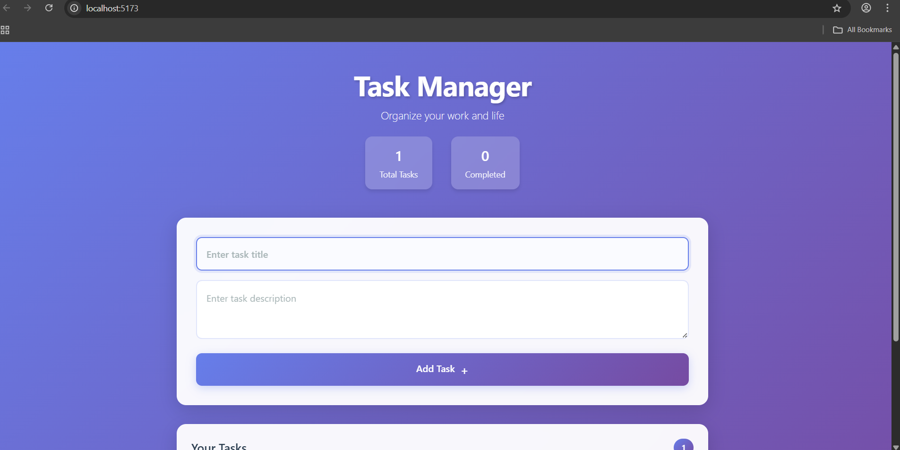
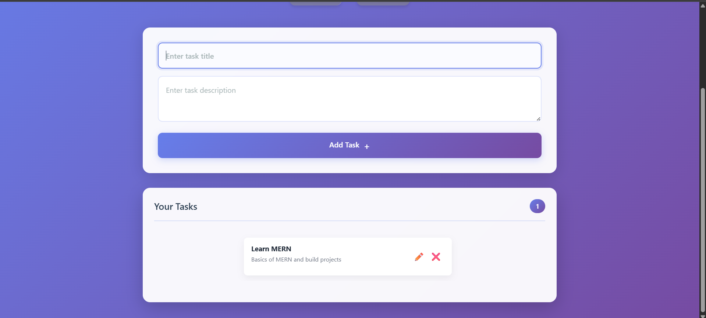

MERN Task Manager 📝

A full-stack MERN Task Manager application built to understand how MongoDB, Express, React, and Node.js work together in a real-world project.

This project focuses on mastering CRUD operations, REST APIs, and frontend–backend–database communication rather than just following tutorials.

🚀 Features

1. Create new tasks

2. View all tasks

3. Edit existing tasks

4. Mark tasks as completed

5. Delete tasks

6. Real-time UI updates without page refresh

7. Clean and beginner-friendly UI

🛠️ Tech Stack

Frontend

1. React

2. JavaScript (ES6+)

3. Fetch API

Backend

1. Node.js

2. Express.js

3. Database

4. MongoDB

5. Mongoose

📁 Project Structure
```
mern-task-manager/
│
├── backend/
│   ├── models/
│   ├── controllers/
│   ├── routes/
│   ├── config/
│   └── server.js
│
├── frontend/
│   ├── components/
│   ├── pages/
│   ├── App.jsx
│   └── main.jsx
│
└── README.md
```

This structure follows real-world MERN application practices and helps keep the codebase organized and scalable.

🔌 API Endpoints
1. Method	Endpoint	Description
2. POST	/tasks	Create a new task
3. GET	/tasks	Get all tasks
4. PUT	/tasks/:id	Update a task
4. DELETE	/tasks/:id	Delete a task

⚙️ How It Works

--The user interacts with the React frontend.

--The frontend sends HTTP requests to the Express backend.

--The backend processes requests and performs CRUD operations using MongoDB.

--The backend sends responses back to the frontend.

--The UI updates instantly based on the response.

--This project helped me understand the complete data flow in a MERN application.

🧠 Key Learnings

--Designing RESTful APIs using Express

--Performing CRUD operations with MongoDB and Mongoose

--Managing state and side effects using React hooks

--Connecting frontend and backend using HTTP requests

--Structuring a full-stack MERN project properly

--Thinking in terms of data flow instead of just UI

▶️ Getting Started
--Prerequisites

--Node.js installed

--MongoDB running locally or on MongoDB Atlas

Backend Setup

```
cd frontend
npm install
npm run dev
```

Create a .env file in the backend folder:

```
MONGO_URI=mongodb://localhost:27017/taskmanager
PORT=5000
```

Frontend Setup
```
cd frontend
npm install
npm run dev
```


📌 Future Enhancements

--User authentication

--Task descriptions and due dates

--Task filtering and searching

--Improved UI and UX

--Deployment to production

📷 Screenshots





🏁 Conclusion

This project helped me transition from learning MERN concepts to applying them in a real application.
It strengthened my understanding of full-stack development and prepared me to build more advanced MERN projects.
